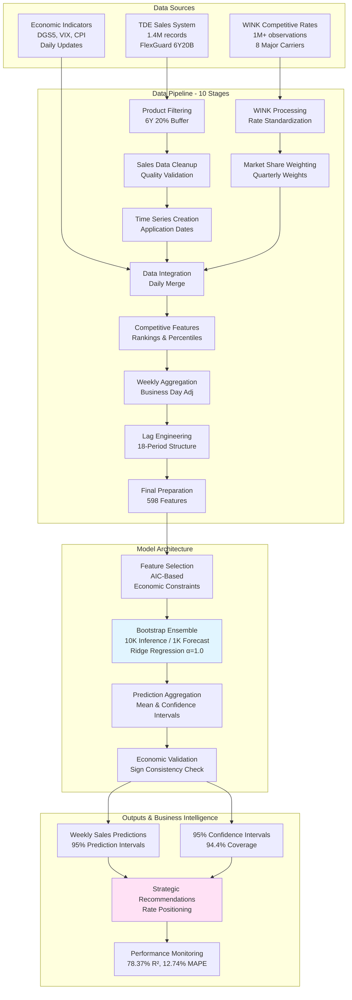

# Annuity Price Elasticity Model V3

[](./docs/development/TESTING_GUIDE.md)
[](./docs/test_quality/README.md)
[](./pyproject.toml)
[](./docs/)
[](./pyproject.toml)
[](./LICENSE)

A rigorously engineered, causal inference framework for estimating price elasticity of demand for annuity products (RILA, FIA, MYGA).

**Status (Jan 2026):**
*   **RILA (6Y20B):** [PRODUCTION] Fully refactored, mathematically equivalent to legacy baselines, and rigorously tested.
*   **FIA/MYGA:** [ALPHA] Architecture is generic, but specific product methodologies are partial or stubbed.

This repository replaces the legacy `annuity-price-elasticity` codebase (V1) with a modular, testable, and scientifically valid architecture.

## Executive Summary

**Business Value:** Predict RILA sales impact of cap rate changes with 78.37% R² accuracy.

**Key Metrics (RILA 6Y20B):**
- **Accuracy:** 78.37% R² (+36% vs benchmark 57.54%)
- **Precision:** 12.74% MAPE (+22% vs benchmark 16.40%)
- **Uncertainty:** 95% CI with 94.4% coverage
- **Competitive Coverage:** 8 major carriers tracked
- **Strategic Window:** 2-week competitive response modeling

**Production Status:** RILA 6Y20B production-ready with 10,000-estimator bootstrap ensemble. FIA/MYGA alpha.

**For business stakeholders:** [docs/business/executive_summary.md](docs/business/executive_summary.md)
**For technical details:** [docs/business/methodology_report.md](docs/business/methodology_report.md)
**For governance:** [docs/business/rai_governance.md](docs/business/rai_governance.md) (RAI000038)

---

## CRITICAL: 5 Traps to Avoid

Before working with this codebase, **read the 5 critical traps** that have caused problems in annuity elasticity work:

> **[docs/integration/LESSONS_LEARNED.md](docs/integration/LESSONS_LEARNED.md)** (MANDATORY)

Key insight: Cap rate is a **YIELD** (customer benefit), NOT a price. Expect a **positive** coefficient on own rate.

---

## Quick Navigation by Role

### First Time Here? (5 minutes)
→ [QUICK_START.md](QUICK_START.md)

### New Data Scientist? (2 hours)
→ [Getting Started Guide](docs/onboarding/GETTING_STARTED.md)
→ [Day One Checklist](docs/onboarding/day_one_checklist.md)
→ [User Journeys Guide](docs/onboarding/USER_JOURNEYS.md)

### Business Stakeholder?
→ [Executive Summary](docs/business/executive_summary.md) (5 min)
→ [Methodology Report](docs/business/methodology_report.md) (45 min)
→ [RAI Governance](docs/business/rai_governance.md) (15 min)

### Model Validator?
→ [Validation Guidelines](docs/methodology/validation_guidelines.md)
→ [Validation Evidence](docs/validation/VALIDATION_EVIDENCE.md) - Mathematical proof of model validity
→ [Common Pitfalls](docs/guides/COMMON_PITFALLS.md) - 5 critical leakage bugs to avoid
> [Leakage Checklist](docs/practices/LEAKAGE_CHECKLIST.md) (MANDATORY)
→ [Model Card](docs/governance/MODEL_CARD.md) - Model documentation for governance
→ [Specification Freeze](docs/governance/SPECIFICATION.md) - Critical thresholds
→ [Deployment Checklist](docs/operations/DEPLOYMENT_CHECKLIST.md)

### Model Developer?
→ [Architecture Overview](docs/architecture/MULTI_PRODUCT_DESIGN.md)
→ [API Reference](docs/api/API_REFERENCE.md)
→ [Testing Strategy](docs/development/TESTING_STRATEGY.md) - 6-layer validation architecture
→ [Coding Standards](docs/development/CODING_STANDARDS.md)
→ [Testing Guide](docs/development/TESTING_GUIDE.md)

### Production Operations?
→ [Deployment Checklist](docs/operations/DEPLOYMENT_CHECKLIST.md) - Manual deployment procedures
→ [Monitoring Guide](docs/operations/MONITORING_GUIDE.md) - AWS CloudWatch monitoring
→ [Emergency Procedures](docs/operations/EMERGENCY_PROCEDURES.md) - Incident response playbooks
→ [Performance Tuning](docs/operations/PERFORMANCE_TUNING.md) - Optimization strategies

### Complete Documentation Index
→ [docs/README.md](docs/README.md) - Full navigation of all 64+ markdown files

---

## Problem Statement

**Why price elasticity for annuities?**

Insurance companies face a critical challenge: **How much do cap rate changes actually affect sales?**

Without rigorous elasticity estimates, pricing teams operate blind:
- Set rates too high → lose margin unnecessarily
- Set rates too low → lose sales to competitors
- React to competitors → but by how much?

This system provides **causal, not correlational** answers:

| Question | Traditional Approach | Our Approach |
|----------|---------------------|--------------|
| "How do rate changes affect sales?" | Naive correlation | Causal identification with lag structure |
| "What's the competitor effect?" | Same-period comparison | 2-week lagged response (causally valid) |
| "How confident are we?" | Point estimates | 95% CI with 94.4% coverage |

**Key insight**: Cap rate is a **YIELD** (customer benefit), not a price. Expect **positive** own-rate coefficients.

## Overview

This system estimates how changes in annuity cap rates affect sales volume, providing actionable insights for pricing decisions. Built on causal econometric methods with robust constraint validation.

### Key Features

- **Multi-Product Support**: RILA (primary), FIA, MYGA product types
- **Dependency Injection**: Clean separation between data sources and business logic
- **Economic Constraints**: Automatic validation of coefficient signs
- **Offline Development**: Fixture-based testing without AWS access

## Quick Start

### Installation

```bash
# Clone repository
git clone <repo-url>
cd annuity-price-elasticity-v3

# Create environment
conda env create -f environment.yml
conda activate annuity-price-elasticity-v3

# Or with pip
pip install -r requirements.txt
```

### Basic Usage

```python
from src.notebooks import create_interface

# Create interface for RILA 6Y20B product
interface = create_interface("6Y20B", environment="fixture")

# Load data
df = interface.load_data()

# Run inference
results = interface.run_inference(df)

# Export results
interface.export_results(results, format="excel")
```

### Production Usage (AWS)

```python
from src.notebooks import create_interface

aws_config = {
    "sts_endpoint_url": "https://sts.us-east-1.amazonaws.com",
    "role_arn": "arn:aws:iam::123456789:role/DataRole",
    "xid": "user123",
    "bucket_name": "my-data-bucket"
}

interface = create_interface(
    "6Y20B",
    environment="aws",
    adapter_kwargs={"config": aws_config}
)

df = interface.load_data()
results = interface.run_inference(df)
```

---

## Testing & Offline Development

### Overview

The project includes **2,467 tests** across multiple test types, all runnable **offline without AWS credentials** using fixtures. This enables fast development iteration, reproducible results, and testing in restricted environments.

**Key Metrics:**
- 2,467 tests across 96 test files
- 44% code coverage (target: 60% for core modules)
- 73 MB of fixture data (203 weeks × 598 features)
- 1e-12 precision mathematical equivalence with AWS
- < 10 minutes full test suite (with pytest-xdist)

### Running Tests

```bash
# All tests (offline by default, no AWS credentials needed)
pytest

# Specific test types
pytest tests/unit/                    # Unit tests (~1,200 tests, < 2 min)
pytest tests/integration/             # Integration tests (~800 tests, < 5 min)
pytest tests/e2e/                     # End-to-end tests (~200 tests, < 3 min)
pytest tests/performance/             # Performance tests (~50 tests, < 5 min)
pytest tests/property_based/          # Property-based tests (~300 tests, < 3 min)

# Skip slow tests (> 30s)
pytest -m "not slow"

# Skip AWS tests (explicit - default behavior)
pytest -m "not aws"

# Parallel execution for speed
pytest -n auto                        # Auto-detect CPU cores

# With coverage report
pytest --cov=src --cov-report=html    # Open htmlcov/index.html
pytest --cov=src --cov-report=term    # Terminal output
```

### Offline Development with Fixtures

Complete development workflow without AWS credentials:

```python
from src.notebooks import create_interface

# Offline mode (no AWS credentials needed)
interface = create_interface("6Y20B", environment="fixture")

# Load data from fixtures (< 5 seconds)
df = interface.load_data()
print(f"Loaded {len(df)} weeks of data")

# Run inference offline
results = interface.run_inference(df)
print(f"R² Score: {results['metrics']['R²']:.4f}")

# Export results
interface.export_results(results, format="excel")
```

**Benefits:**
- **10-100x faster** data loading (no S3 latency)
- **No credentials** required for development
- **Reproducible** results across machines
- **Works offline** (planes, trains, anywhere)
- **Cost savings** (no S3 read costs)

### Fixture System

The fixture system uses a **three-tier hierarchy** optimized for test performance:

#### Available Fixtures

**Location:** `tests/fixtures/rila/`
**Size:** 73 MB total

| Fixture | Size | Rows | Columns | Description |
|---------|------|------|---------|-------------|
| `raw_sales_data.parquet` | 11 MB | 2.8M | 11 | Sales transactions |
| `raw_wink_data.parquet` | 12 MB | 1.1M | 19 | Competitive rates |
| `market_share_weights.parquet` | 8 KB | 19 | 11 | Market weights |
| `final_weekly_dataset.parquet` | 1.1 MB | 203 | 598 | Ready for inference |
| `economic_indicators/` | ~1 MB | Varies | Varies | CPI, DGS5, VIX |
| `stage_01..10_output.parquet` | ~5 MB | Varies | Varies | Pipeline stages |

#### Fixture Hierarchy

**SMALL** (unit tests):
- Size: 20-100 rows, 5-20 features
- Load time: < 0.1 seconds
- Use: Fast unit tests, TDD iteration

**MEDIUM** (integration tests):
- Size: 100-1,000 rows, 20-100 features
- Load time: 0.1-1 seconds
- Use: Module integration, pipeline testing

**LARGE** (E2E tests):
- Size: Full production dataset (203 weeks × 598 features)
- Load time: 1-5 seconds
- Use: End-to-end validation, baseline comparison

### Mathematical Equivalence

Fixture-based tests maintain **1e-12 precision equivalence** with AWS execution through:

1. **Stage-by-Stage Validation**: Each of 10 pipeline stages validated independently
2. **Statistical Validation**: Bootstrap results validated across multiple runs
3. **End-to-End Validation**: Full pipeline validated against AWS baselines

```python
# Example: Validate against baseline at 1e-12 precision
import numpy as np

def test_pipeline_equivalence(result, baseline):
    np.testing.assert_allclose(
        result['coefficients'],
        baseline['coefficients'],
        rtol=1e-12,
        atol=1e-12
    )
```

### AWS Integration Testing

AWS tests are marked with `@pytest.mark.aws` and **skipped by default** in offline mode:

```bash
# Set AWS credentials
export STS_ENDPOINT_URL="https://sts.us-east-1.amazonaws.com"
export ROLE_ARN="arn:aws:iam::123456789012:role/YourRole"
export XID="your-external-id"
export BUCKET_NAME="your-bucket"

# Run AWS tests explicitly
pytest -m aws -v

# AWS vs fixture equivalence validation
pytest tests/integration/test_aws_fixture_equivalence.py -m aws -v
```

**When to Run AWS Tests:**
- Before production deployment
- Quarterly fixture refresh
- After major data source changes
- When validating new AWS integrations

### Fixture Refresh

Fixtures are refreshed **quarterly** from AWS production data:

```bash
# Refresh fixtures from AWS (requires credentials)
python tests/fixtures/refresh_fixtures.py

# Validate refreshed fixtures
pytest tests/fixtures/test_fixture_validity.py -v

# Test AWS vs fixture equivalence
pytest -m aws -v
```

**Quarterly Schedule:** Q1 (January), Q2 (April), Q3 (July), Q4 (October)

### Performance Testing

Performance baseline tests detect regressions:

```bash
# Run performance tests (skip slow ones)
pytest tests/performance/ -m "not slow" -v

# Include slow tests (bootstrap 10K, full pipeline)
pytest tests/performance/ -v
```

**Baseline Thresholds:**
- Feature engineering: < 2s (medium dataset)
- Bootstrap 1000: < 30s
- Bootstrap 10000: < 5 minutes
- Full pipeline: < 6 minutes

### Test Markers

Tests are marked for selective execution:

| Marker | Description | Default Behavior |
|--------|-------------|------------------|
| `@pytest.mark.aws` | Requires AWS credentials | Skipped in offline mode |
| `@pytest.mark.slow` | Takes > 30 seconds | Included by default |
| `@pytest.mark.e2e` | End-to-end tests | Included by default |
| `@pytest.mark.integration` | Integration tests | Included by default |
| `@pytest.mark.performance` | Performance tests | Included by default |

### Documentation

**Complete Guides:**
- **Testing Guide**: [docs/development/TESTING_GUIDE.md](docs/development/TESTING_GUIDE.md) - Comprehensive testing strategy (12 sections)
- **Offline Development**: [docs/onboarding/OFFLINE_DEVELOPMENT.md](docs/onboarding/OFFLINE_DEVELOPMENT.md) - Complete offline workflow
- **Fixture Management**: [tests/fixtures/README.md](tests/fixtures/README.md) - Fixture refresh procedures
- **Performance Testing**: [tests/performance/README.md](tests/performance/README.md) - Performance baselines

---

## Working with Fixture Data (Legacy Pattern)

The codebase supports offline development using fixture data captured from AWS S3, enabling development without AWS credentials.

### Overview

**Location**: `tests/fixtures/rila/`
**Size**: 73MB of pre-captured data for FlexGuard 6Y20B product
**Requirements**: No AWS credentials needed

### Fixture Contents

- **Sales**: raw_sales_data.parquet (2.8M records, 39MB)
- **Rates**: raw_wink_data.parquet (1.1M records, 12MB)
- **Weights**: market_share_weights.parquet (8.3KB)
- **Macro**: economic_indicators/*.parquet (CPI, DGS5, VIX)

### Usage Pattern 1: Unified Interface (Recommended)

```python
from src.notebooks import create_interface

# Fixture mode - no AWS needed
interface = create_interface("6Y20B", environment="fixture")
df = interface.load_data()
results = interface.run_inference(df)
```

### Usage Pattern 2: Direct FixtureAdapter

```python
from pathlib import Path
from src.data.adapters import FixtureAdapter

adapter = FixtureAdapter(Path("tests/fixtures/rila"))
sales = adapter.load_sales_data(product_filter=None)
rates = adapter.load_competitive_rates(start_date="2020-01-01")
weights = adapter.load_market_weights()
macro = adapter.load_macro_data()
```

### Usage Pattern 3: Notebook OFFLINE_MODE Toggle

```python
# In notebooks/rila/00_data_pipeline.ipynb
OFFLINE_MODE = True  # Toggle for fixture vs AWS

if OFFLINE_MODE:
    from src.validation_support.aws_mock_layer import setup_offline_environment
    setup_offline_environment(fixture_path=Path("tests/fixtures/rila"))
```

### Important Notes

- **Product Name Mismatch**: ProductConfig uses "FlexGuard 6Y20B" but raw data contains "FlexGuard indexed variable annuity". Pipeline builders handle this automatically via default product name parameter.
- **Method Names**: FixtureAdapter uses `load_competitive_rates()` and `load_market_weights()` (not `load_rates_data` or `load_weights_data`).
- **Economic Indicators**: Macro data is stored in `economic_indicators/` subdirectory and loaded automatically.

## Products Supported

| Product Code | Type | Buffer Level | Term | R² | MAPE | Status |
|--------------|------|--------------|------|-----|------|--------|
| 6Y20B | RILA | 20% | 6 years | 78.37% | 12.74% | Production |
| 6Y10B | RILA | 10% | 6 years | TBD | TBD | Production |
| 10Y20B | RILA | 20% | 10 years | TBD | TBD | Production |
| FIA | FIA | N/A | Varies | - | - | Alpha/Stub |
| MYGA | MYGA | N/A | Varies | - | - | Alpha/Stub |

**Reference:** [docs/business/methodology_report.md](docs/business/methodology_report.md) for complete performance metrics

## Project Structure

```
annuity-price-elasticity-v3/
├── src/
│   ├── core/              # Protocols, types, registries
│   ├── notebooks/         # UnifiedNotebookInterface
│   ├── data/adapters/     # S3, Local, Fixture adapters
│   ├── features/          # Feature engineering
│   │   ├── aggregation/   # Competitor strategies
│   │   └── selection/     # Feature selection
│   ├── products/          # Product methodologies
│   ├── config/            # Configuration builders
│   ├── models/            # Inference models
│   └── validation/        # Validators
├── notebooks/
│   ├── rila/              # RILA analysis notebooks
│   └── fia/               # FIA analysis notebooks
├── tests/
│   ├── fixtures/          # Test data (74MB RILA, 14MB FIA)
│   └── baselines/         # Reference outputs
├── knowledge/             # Domain documentation
│   ├── domain/            # Product economics
│   ├── analysis/          # Causal framework
│   └── practices/         # Validation guidelines
└── docs/                  # Architecture docs
```

## Testing (Quick Reference)

```bash
# Run all tests offline (no AWS credentials needed)
pytest

# Run with coverage
pytest --cov=src --cov-report=html

# Fast test suite (skip slow tests)
pytest -m "not slow"

# Parallel execution
pytest -n auto

# Quick validation
make quick-check
```

**For complete testing guide, see:** [Testing & Offline Development](#testing--offline-development) section above or [docs/development/TESTING_GUIDE.md](docs/development/TESTING_GUIDE.md)

## Economic Constraints

The system validates model coefficients against economic theory:

| Coefficient | Expected Sign | Rationale |
|-------------|--------------|-----------|
| Own rate | **Positive** | Higher rates attract customers |
| Competitor rates | **Negative** | Substitution effect |

**CRITICAL**: Lag-0 competitor features are forbidden (violates causal identification).

## For New Data Scientists

**Start here if you're joining the team.**

### Two Onboarding Paths

**Path 1: Quick Start (5 minutes)**
```
QUICK_START.md → Run first inference → notebooks/onboarding/architecture_walkthrough.ipynb
```

**Path 2: Complete Onboarding (2+ hours)**
```
START HERE
    |
    v
docs/onboarding/GETTING_STARTED.md          <- Orientation (2 hours)
    |
    v
docs/domain-knowledge/RILA_ECONOMICS.md     <- Product basics
    |
    v
docs/analysis/CAUSAL_FRAMEWORK.md           <- Why we model this way
    |
    v
docs/integration/LESSONS_LEARNED.md         <- Critical traps
    |
    v
notebooks/onboarding/architecture_walkthrough.ipynb  <- Hands-on

REFERENCE AS NEEDED:
  - docs/domain-knowledge/GLOSSARY.md         - Terms and definitions
  - docs/development/MODULE_HIERARCHY.md      - Code navigation
  - docs/onboarding/COMMON_TASKS.md           - Copy-paste recipes
  - docs/onboarding/day_one_checklist.md      - Interactive first-day plan
```

### Quick Start for Fixtures (No AWS Needed)

```python
from src.notebooks import create_interface

# Use fixture data (no credentials required)
interface = create_interface("6Y20B", environment="fixture")
df = interface.load_data()
results = interface.run_inference(df)
print(results["coefficients"])
```

### Using Claude Code

This repository is optimized for AI-assisted development. See `docs/onboarding/USING_CLAUDE_CODE.md` for how to use Claude Code effectively.

## Key Documents

### Business & Governance
- **docs/business/executive_summary.md**: 1-page business overview
- **docs/business/methodology_report.md**: Complete technical methodology (1,631 lines)
- **docs/business/rai_governance.md**: RAI000038 compliance documentation

### Technical Documentation
- **docs/analysis/CAUSAL_FRAMEWORK.md**: Identification strategy
- **docs/methodology/feature_engineering_guide.md**: 598-feature pipeline explained
- **docs/methodology/validation_guidelines.md**: Complete validation framework
- **docs/practices/LEAKAGE_CHECKLIST.md**: Pre-deployment validation (**MANDATORY**)

### Development
- **CLAUDE.md**: Development guidance for AI-assisted coding
- **docs/integration/LESSONS_LEARNED.md**: Five critical traps to avoid
- **docs/development/MODULE_HIERARCHY.md**: Code navigation guide

## Architecture

### System Architecture Diagram



### Code Architecture (v2 Refactor)

The v2 architecture uses dependency injection for flexibility:

```
UnifiedNotebookInterface
├── DataSourceAdapter (S3/Local/Fixture)
├── AggregationStrategy (Weighted/TopN/FirmLevel)
└── ProductMethodology (RILA/FIA/MYGA)
```

**Complete documentation:** [docs/architecture/MULTI_PRODUCT_DESIGN.md](docs/architecture/MULTI_PRODUCT_DESIGN.md)

## Contributing

1. Follow patterns in `CLAUDE.md`
2. Ensure tests pass: `make test`
3. Validate patterns: `make quick-check`
4. No emoji in commits

## Historical Archive

The `_archive_refactoring/` directory contains validation artifacts from the V1→V2 refactoring (Jan 2026):
- Investigation reports confirming AWS connectivity
- Comparison scripts validating mathematical equivalence
- Implementation tracking and production readiness documentation

These files are preserved for historical reference only. See `_archive_refactoring/README.md` for details.

---

## Troubleshooting

### Common Issues

| Issue | Solution |
|-------|----------|
| `ModuleNotFoundError: src` | Run from repo root, ensure `pip install -e .` |
| Fixture data missing | Run `make setup-notebook-fixtures` |
| AWS credentials expired | Re-authenticate with STS, check ROLE_ARN |
| Negative own-rate coefficient | Check feature selection; may indicate leakage |
| R² unexpectedly high (>0.95) | Likely data leakage; run `make leakage-audit` |

### Diagnostic Commands

```bash
# Verify installation
python -c "from src.notebooks import create_interface; print('OK')"

# Run leakage gates
pytest tests/anti_patterns/ -v

# Check fixture integrity
pytest tests/fixtures/test_fixture_validity.py -v

# Quick smoke test
make quick-check
```

### Getting Help

- **Documentation Index**: [docs/README.md](docs/README.md)
- **Common Pitfalls**: [docs/guides/COMMON_PITFALLS.md](docs/guides/COMMON_PITFALLS.md)
- **Leakage Checklist**: [knowledge/practices/LEAKAGE_CHECKLIST.md](knowledge/practices/LEAKAGE_CHECKLIST.md)
- **AI Methodology**: [docs/methodology/AI_COLLABORATION_METHODOLOGY.md](docs/methodology/AI_COLLABORATION_METHODOLOGY.md)

---

## License

MIT License
