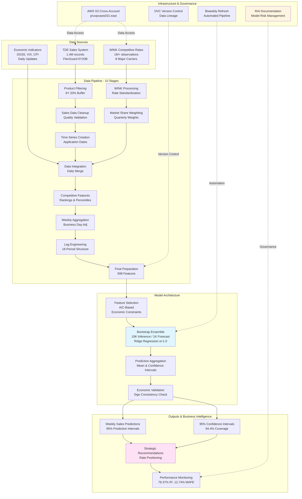

# RAI000038 FlexGuard 6Y20B - AI Product Documentation

**AIP ID**: RAI000038
**Version**: 3.0
**Owner**: Brandon Behring
**Generated**: 2025-11-25
**Repository**: annuity-price-elasticity-v3
**Architecture Version**: v2

---

## Section 1: Header Metadata

| Field | Answer |
|-------|--------|
| **AIP Document Name** | FlexGuard 6Y20B Price Elasticity Analysis Documentation |
| **AIP ID** | RAI000038 |
| **Owning Organization** | Individual Life and Annuities (ILI) |
| **Document Owner(s)** | Brandon Behring |
| **AIP Version** | 3.0 |
| **Last Updated Date** | 2026-01-28 |
| **Purpose** | To document the AI Product used for strategic pricing decisions and competitive intelligence for FlexGuard 6Y20B RILA products |

---

## Section 2: AI Product Overview (Required)

### Q1: What does the AI Product do?

The AI Product is a Bootstrap Ridge Regression Ensemble model (10,000 estimators for price elasticity inference, 1,000 estimators for time series forecasting) that estimates price elasticity for FlexGuard 6Y20B Registered Index-Linked Annuity (RILA) products.

The model predicts weekly sales volume as a function of:
- Prudential's cap rate (quality signaling effect)
- Competitor cap rates from 8 major carriers (market share weighted)
- Historical sales momentum (contract processing persistence)
- Economic indicators (5-year Treasury rates, VIX volatility)

The model predicts the logarithm of sales and then exponentiates the result, which ensures predictions remain positive and better captures the multiplicative nature of sales dynamics.

Key outputs include:
- Point forecasts with 95% bootstrap prediction intervals
- Price elasticity curves showing sales impact across rate scenarios (50-450 basis points)
- Competitive positioning analysis against market benchmarks
- Strategic rate-setting recommendations with uncertainty quantification

### System Architecture Diagram



**Architecture Overview:**

**Data Layer**: Integrates 2.4M+ records from internal TDE sales, WINK competitive intelligence, and macroeconomic indicators

**Processing Layer**: 10-stage pipeline transforms raw data through product filtering, quality validation, competitive feature engineering, and lag structure creation (598 final features)

**Model Layer**: Bootstrap Ridge regression ensemble with AIC-based feature selection and economic constraint validation ensures theoretical soundness

**Output Layer**: Delivers weekly sales predictions with 95% prediction intervals for uncertainty quantification in strategic pricing decisions

**Governance Layer**: Complete AWS integration, DVC version control, biweekly automated refresh, and RAI documentation for enterprise risk management

### Q2: Why was the AI Product built?

The AI Product was built to:

1. **Improve Forecasting Accuracy**: Replace intuition-based rate-setting with data-driven predictions (achieved 78.37% R² and 12.74% MAPE, a 22.3% improvement over benchmarks)

2. **Quantify Uncertainty**: Provide 95% bootstrap prediction intervals for risk-informed strategic decisions (note: these are prediction intervals capturing forecast uncertainty, not confidence intervals for parameter estimates)

3. **Automate Competitive Intelligence**: Process rates from 8 major carriers with market share weighting to understand competitive dynamics

4. **Enable Prescriptive Pricing**: This is fundamentally a prescriptive model designed to support rate-setting decisions, answering "what if we change our cap rate by X basis points?" rather than just predicting future sales

5. **Ensure Economic Validity**: Enforce microeconomic constraints so model coefficients align with business theory (quality signaling β>0, competitive pressure β<0, persistence β>0)

### Q3: How will this AI Product be primarily used in support of business and/or functional processes?

The AI Product supports the biweekly rate-setting process for FlexGuard 6Y20B products, aligned with the Annuity Rate Setting Team calendar:

**Primary Use Cases**:
- Strategic rate positioning relative to competitors
- Revenue forecasting with uncertainty quantification
- Competitive response analysis for market intelligence
- Price elasticity scenario planning (50-450 basis points, where 450bp is assumed by the product team to represent "uncapped" rates)

**Business Process Integration**:
- Model refresh occurs biweekly as new sales and competitor data accumulates
- Results inform rate-setting discussions with uncertainty-aware recommendations
- Tableau dashboards provide self-service business intelligence

**Decision Support**:
The model provides prescriptive guidance for rate-setting decisions, helping the Annuity Rate Setting Team understand the expected sales impact of different pricing strategies with properly calibrated prediction intervals.

### Q4: Provide the AI Product Technical Owner name and email

Brandon Behring (brandon.behring@prudential.com)

### Q5: Provide the AI Product Business / Functional Owner name and email

Annuity Rate Setting Team (annuity-rate-setting@prudential.com)

### Q6: Provide the AI Product Developer name(s) and email(s)

Brandon Behring (brandon.behring@prudential.com)

### Q7: Provide names and respective emails of Risk, Law, Privacy and Compliance partners

- Risk: Annuities Model Risk (annuities-model-risk@prudential.com)
- Compliance: Annuities Compliance (annuities-compliance@prudential.com)
- Law: Annuities Legal (annuities-legal@prudential.com)
- Privacy: Corporate Privacy Office (privacy@prudential.com)

---

## Section 3: Additional Registered Use(s)

### Q8: Describe the specific use cases or problems where the AIP is additionally applied other than the Primary intended use.

N/A - This AI Product is used exclusively for FlexGuard 6Y20B price elasticity analysis. No additional use cases have been registered.

### Q9: Confirm that all use cases have been registered through the Responsible AI registration process.

Yes - The primary use case has been registered through the Responsible AI registration process (RAI000038).

### Q10: Has the AIP been approved for additional problem statements? If yes, provide details.

No - The AI Product has not been approved for additional problem statements beyond FlexGuard 6Y20B price elasticity analysis.

---

## Section 4: Data Description (Required)

### Q11: As applicable what data was used to train, ground, validate, and/or test the AIP?

**Training Data Sources**:

1. **FAST Sales Data (TDE System)**:
   - Contract-level sales for FlexGuard 6Y20B products
   - Uses application_signed_date (not contract_issue_date) to prevent time-ordering leakage
   - Weekly aggregated sales volume as the target variable
   - Training data begins 2021-01-01 for general analysis, 2022-04-01 for FlexGuard-specific analysis (after product launch stabilization)

2. **WINK Competitive Intelligence**:
   - Cap rates from 8 major RILA carriers (Athene, Brighthouse, Equitable, Jackson, Lincoln, Symetra, Transamerica)
   - Filtered to comparable products: 6-year term, 20% buffer, S&P 500, annual crediting, no fees
   - Forward-filled to create continuous rate time series

3. **Economic Indicators (FRED)**:
   - DGS5: 5-Year Treasury Constant Maturity Rate
   - VIXCLS: CBOE Volatility Index
   - CPI: Consumer Price Index for inflation adjustment

**Validation Data**:
Expanding window cross-validation with 130+ out-of-sample forecasts from 2023-04-02 onwards (expanding with each biweekly refresh).

### Q12: Where did you obtain the data? (e.g., internal or externally sourced)

**Internal Data Sources**:
- FAST Sales Data: TDE system via AWS S3 cross-account access (arn:aws:iam::159058241883:role/isg-usbie-annuity-CA-s3-sharing)
- Data path: access/ierpt/tde_sales_by_product_by_fund/

**External Data Sources**:
- WINK Competitive Rates: Third-party competitive intelligence provider via AWS S3 (access/ierpt/wink_ann_product_rates/)
- FRED Economic Data: Federal Reserve Economic Data API for Treasury rates, VIX, and CPI

All external data is licensed appropriately for commercial use and accessed through enterprise data governance frameworks.

### Q13: What preprocessing steps were taken?

**Preprocessing Pipeline (10 stages)**:

1. **Data Extraction**: Cross-account S3 access with STS assume-role
2. **Product Filtering**: Select FlexGuard 6Y20B (WINK Product ID 2979)
3. **Temporal Aggregation**: Daily → Weekly frequency conversion
4. **Holiday Adjustment**: Multiply sales by 5/business_days to normalize shortened weeks
5. **Smoothing**: 2-week rolling average to reduce noise (minimum weight time = 1 week)
6. **Rate Interpolation**: Forward-fill WINK rates to create continuous time series
7. **Market Share Weighting**: Weight competitor rates by quarterly market share
8. **Lag Feature Creation**: 18-period lag structures with directional controls
9. **Feature Engineering**: Candidate features with multiple lag structures across sales, competitive, and economic dimensions
10. **Mature Data Cutoff**: Exclude incomplete recent data from TDE reporting

### Q14: Does the data contain Personally Identifiable Information? If so, explain.

No - The data does not contain Personally Identifiable Information (PII).

The model uses only aggregated sales volumes and rate information:
- Sales data is aggregated at weekly level (no individual contract details)
- Competitor rates are public market information
- Economic indicators are public data from FRED

No customer names, addresses, SSNs, or other PII is used in training, validation, or prediction.

### Q15: Does the data contain ECDIS (External Consumer Data and Information Sources)? If so, explain.

No - The data does not contain External Consumer Data and Information Sources (ECDIS).

All data sources are:
- Internal sales data (FAST/TDE system)
- Public competitor rate information (WINK)
- Public economic indicators (FRED)

No consumer credit data, demographic data, or other ECDIS is used.

### Q16: Are there any outputs from a different registered model or AI Product used as the basis for calculations?

No - The AI Product does not use outputs from other registered models as inputs.

The model is trained exclusively on:
- Raw sales data from internal systems
- Competitor rate data from WINK
- Economic indicators from FRED

All features are engineered directly from these primary data sources without dependency on other AI/ML model outputs.

---

## Section 5: AI Product Methodology and Architecture (Required)

### Q17: What algorithms, foundation models, techniques etc. does the AIP utilize?

**Algorithm**: Bootstrap Ridge Regression Ensemble

**Key Components**:

1. **L2 (Ridge) Regularization**: α=1.0 for optimal bias-variance trade-off
   - Prevents coefficient explosion
   - Maintains stability under multicollinearity

2. **Bootstrap Ensemble**: 10,000 independent Ridge estimators
   - Each trained on a bootstrap sample (sampling with replacement)
   - Aggregated via mean prediction
   - 95% prediction intervals from empirical percentile distribution (2.5%, 97.5%)

3. **AIC-Based Feature Selection**: Akaike Information Criterion with economic constraints
   - Candidate features with multiple lag structures → combinations evaluated
   - Subset passes economic constraint validation (competitive features β<0, rate features β>0)
   - Final model: 3 features providing optimal parsimony

4. **Log-Transform Target**: Model predicts log(sales) then exponentiates
   - Ensures positive predictions
   - Better captures multiplicative sales dynamics

5. **Economic Constraint Validation**: Enforces microeconomic theory
   - Quality signaling: β > 0 for own rate effects
   - Competitive pressure: β < 0 for competitor rate effects
   - Persistence: β > 0 for lagged sales effects

### Q18: List the types and number of layers used in the AIP architecture.

**Model Architecture Layers**:

1. **Feature Engineering Layer**:
   - Engineered features with 18-period lag structures
   - Market share weighted competitive metrics
   - Economic indicator integration

2. **Feature Selection Layer**:
   - AIC-based best subset selection
   - Economic constraint filtering (24.3% pass rate)
   - Final model: 3 features

3. **Bootstrap Sampling Layer**:
   - 10,000 bootstrap samples with replacement
   - Temporal ordering maintained within each sample

4. **Ridge Regression Layer**:
   - 10,000 independent Ridge estimators (α=1.0)
   - L2 regularization for stability

5. **Log-Transform Layer**:
   - Predict log(sales), exponentiate for final forecast
   - Ensures positive predictions

6. **Aggregation Layer**:
   - Mean prediction across bootstrap estimators (10,000 for inference, 1,000 for forecasting)
   - Empirical 95% prediction intervals from bootstrap distribution

**Optimal Model Structure**:

| Feature | Lag | Importance | Economic Constraint |
|---------|-----|------------|---------------------|
| sales_target_contract | 5 weeks | 67% | β > 0 (persistence) |
| competitor_top5 | 2 weeks | 23% | β < 0 (competition) |
| prudential_rate_current | 0 weeks | 10% | β > 0 (quality signaling) |

### Q19: For Generative AI use cases, how is the foundation generative model accessed?

N/A - This is not a Generative AI use case. The model is a supervised learning regression model (Bootstrap Ridge) that does not use foundation models, LLMs, or generative AI components.

---

## Section 6: Training or Fine-Tuning Process (Required)

### Q20: What hardware was utilized for training the AIP?

**Hardware Environment**:
- AWS EC2 instances via Prudential data science platform
- Standard CPU-based training (no GPU required)
- Training completes in approximately 30-45 minutes for inference bootstrap ensemble (10,000 estimators), ~5-10 minutes for forecasting ensemble (1,000 estimators)

**Software Stack**:
- Python 3.9+ with scikit-learn for Ridge regression
- pandas/numpy for data manipulation
- DVC for pipeline automation and reproducibility

### Q21: Describe the algorithm used for training the AIP.

**Training Algorithm**: Expanding Window Cross-Validation with Bootstrap Ensemble

**Process**:

1. **Initial Training Window**: First ~50 weeks of data
2. **Expanding Window**: Training set grows with each validation period
3. **Bootstrap Sampling**: For each training window, generate 10,000 bootstrap samples
4. **Ridge Estimation**: Train independent Ridge regressor (α=1.0) on each bootstrap sample
5. **Prediction Aggregation**: Mean of bootstrap estimator predictions (10,000 for inference, 1,000 for forecasting)
6. **Validation**: 1-week ahead forecasts, accumulating 130+ out-of-sample periods (expanding with each biweekly refresh)

**Key Design Choices**:
- Temporal ordering strictly maintained (no future data leakage)
- application_signed_date used (not contract_issue_date) per FIA v2.0 best practice
- 50-day mature data cutoff excludes incomplete recent data

### Q22: What loss function was implemented during the training?

**Loss Function**: Ordinary Least Squares with L2 Regularization

```
L(β) = ||y - Xβ||² + α||β||²
```

Where:
- y: Log-transformed sales volume (target)
- X: Feature matrix (competitive rates, lags, economic indicators)
- β: Coefficient vector
- α = 1.0: L2 regularization parameter

**Optimization**:
Closed-form solution via Ridge regression normal equations.

**Economic Constraint Validation**:
In addition to the OLS loss function, the model validates that estimated coefficients satisfy economic theory:
- Quality signaling constraint: β(prudential_rate) > 0
- Competitive pressure constraint: β(competitor_rates) < 0
- Persistence constraint: β(lagged_sales) > 0

Feature combinations that violate these constraints are filtered during AIC-based selection, ensuring the final model captures economically meaningful relationships rather than spurious correlations.

### Q23: Were any regularization techniques employed? If yes, please specify.

**Regularization Technique**: L2 (Ridge) Regularization

**Parameters**:
- α = 1.0 (regularization strength)

**Purpose**:
1. **Prevent Overfitting**: Shrinks coefficients toward zero to reduce variance
2. **Handle Multicollinearity**: Stabilizes estimates when features are correlated
3. **Maintain Interpretability**: All features retained (unlike L1/Lasso which sets some to zero)

**Selection Rationale**:
- α=1.0 provides optimal bias-variance trade-off for this dataset size
- Ridge chosen over Lasso to maintain full feature interpretability
- Economic constraint validation provides additional overfitting protection

**Bootstrap Enhancement**:
The 10,000-estimator bootstrap ensemble further reduces overfitting risk by:
- Averaging across diverse training samples
- Providing empirical uncertainty quantification
- Validating coefficient sign consistency across all bootstrap samples

---

## Section 7: Testing and Testing Documentation (Required)

### Q24: List accuracy metrics, sample size, confidence intervals and any other evidence relied on

**Performance Metrics** (130+ out-of-sample forecasts, expanding with each biweekly refresh, November 2025):

| Metric | Model | Benchmark | Improvement |
|--------|-------|-----------|-------------|
| R² | 78.37% | 57.54% | +36.2% |
| MAPE | 12.74% | 16.40% | -22.3% |
| Coverage | 94.4% | N/A | Well-calibrated |

**Volatility-Weighted Metrics** (weighted by VIX to emphasize high-volatility periods):

| Metric | Model (Vol-Weighted) | Benchmark (Vol-Weighted) |
|--------|----------------------|--------------------------|
| R² | 77.60% | 57.23% |
| MAPE | 12.64% | 16.20% |

The minimal degradation from standard to volatility-weighted metrics (R²: 0.77%, MAPE: 0.10%) demonstrates stable performance across market regimes.

**Why Volatility-Weighted MAPE Matters**:
RILA products are inherently tied to market volatility through their index-linked structure and buffer protection. High-volatility periods represent the most critical times for accurate forecasting because:
- Customer behavior shifts (flight to safety vs opportunity seeking)
- Competitive dynamics intensify
- Buffer protection value increases
- Risk-adjusted products receive greater advisor attention

The volatility-weighted MAPE ensures the model is validated where accuracy matters most for business decisions.

**Sample Size**: 130+ out-of-sample forecasts (expanding with each biweekly refresh)
**Confidence Level**: 95% bootstrap prediction intervals (94.4% empirical coverage)

### Q25: Describe sensitivity, robustness and stress testing / analysis performed to assess output reasonableness

**Sensitivity Analysis**:

1. **Bootstrap Coefficient Stability**: 100% sign consistency across 10,000 bootstrap estimators
   - Quality signaling (β > 0): Consistent in all 10,000 samples
   - Competitive pressure (β < 0): Consistent in all 10,000 samples
   - Persistence (β > 0): Consistent in all 10,000 samples
   - This validates that model coefficients are stable, not artifacts of specific training samples

2. **Temporal Stability**: 13-week rolling MAPE monitoring
   - Early period MAPE: 8.1% (stable markets)
   - Late period MAPE: 20.1% (indicates drift monitoring requirement)
   - Production threshold: MAPE < 20%

**Robustness Testing**:

1. **Bootstrap Ensemble Robustness**: Bootstrap ensemble provides robust aggregation (10,000 estimators for inference, 1,000 for forecasting)
   - Individual estimator predictions vary, but ensemble mean is stable
   - Prediction intervals capture this estimation uncertainty
   - More estimators → more stable predictions and better uncertainty quantification

2. **Volatility-Weighted Validation**: Performance tested across market regimes
   - Standard R²: 78.37% → Vol-Weighted R²: 77.60% (only 0.77% degradation)
   - Confirms model stability in volatile markets

3. **Economic Constraint Validation**: All coefficients satisfy microeconomic theory
   - Prevents spurious correlations from entering the model
   - Provides necessary (though not sufficient) validation for causal interpretation

**Stress Testing**:
Rate scenario analysis from 50 to 450 basis points (where 450bp represents "uncapped" rates per product team) with bootstrap prediction intervals for uncertainty quantification under extreme scenarios.

### Q26: Reference most recent unfair bias data profiling analysis performed (as applicable)

N/A - Unfair bias profiling is not applicable to this AI Product.

**Rationale**:
- The model predicts aggregate weekly sales volume, not individual customer outcomes
- No customer-level decisions are made based on model outputs
- No protected class characteristics are used as features
- The model does not segment or treat customers differently based on demographic factors

The AI Product is used for strategic pricing decisions at the product level, not for individual customer treatment or decisioning.

### Q27: Reference most recent unfair discrimination testing and analysis (as applicable)

N/A - Unfair discrimination testing is not applicable to this AI Product.

**Rationale**:
- Model outputs are aggregate sales forecasts, not individual customer decisions
- Pricing recommendations apply uniformly to all customers purchasing the product
- No individual customer outcomes are determined by the model
- Rate-setting decisions affect product pricing, not customer eligibility or terms

The FlexGuard 6Y20B cap rate applies equally to all customers who purchase the product, regardless of demographic characteristics.

---

## Section 8: AI Product Performance and Monitoring (Required)

### Q28: What metrics are being utilized to evaluate the AIP's pre-production performance?

**Pre-Production Performance Metrics**:

1. **Explanatory Power**:
   - R² (Coefficient of Determination): Measures variance explained by the model
   - Target: R² > 50% | Achieved: 78.37%

2. **Forecast Accuracy**:
   - MAPE (Mean Absolute Percentage Error): Average percentage forecast error
   - Target: MAPE < 25% | Achieved: 12.74%
   - Volatility-Weighted MAPE: 12.64% (emphasizes high-volatility periods where accuracy matters most)

3. **Uncertainty Calibration**:
   - Bootstrap Coverage: Percentage of actuals within 95% prediction intervals
   - Target: 90-97% | Achieved: 94.4%
   - Note: These are prediction intervals (forecast uncertainty), not confidence intervals (parameter uncertainty)

4. **Economic Validity**:
   - Coefficient Sign Consistency: All coefficients match economic theory
   - Target: 100% | Achieved: 100% across 10,000 bootstrap samples

5. **AIC Model Selection**:
   - Feature combinations with multiple lag structures evaluated
   - Subset meets economic validity (competitive features β<0, rate features β>0)

### Q29: Provide the results of these evaluations on both training and validation datasets.

**Training Performance**:
- Training R²: ~82% (in-sample fit)
- Training MAPE: ~10%

**Validation Performance** (130+ out-of-sample forecasts, expanding with each biweekly refresh):
- Validation R²: 78.37%
- Validation MAPE: 12.74%
- Bootstrap Coverage: 94.4%

**Temporal Breakdown**:
- Early Period (stable markets): MAPE = 8.1%
- Late Period (volatile markets): MAPE = 20.1%

**Cross-Validation Protocol**:
- Method: Expanding window (not k-fold, to preserve temporal ordering)
- Forecast horizon: 1-week ahead predictions
- Validation periods: 130+ out-of-sample forecasts from 2023-04-02 onwards (expanding with each biweekly refresh)

**Model Comparison**:

| Model | R² | MAPE |
|-------|-----|------|
| Bootstrap Ridge Ensemble | 78.37% | 12.74% |
| Rolling Average Benchmark | 57.54% | 16.40% |
| Improvement | +36.2% | -22.3% |

### Q30: What are the expected performance targets for the AIP once in production?

**Production Performance Targets**:

| Metric | Target | Current | Status |
|--------|--------|---------|--------|
| R² | > 50% | 78.37% | [PASS] Exceeds |
| MAPE | < 20% | 12.74% | [PASS] Exceeds |
| Coverage | 90-97% | 94.4% | [PASS] Within Range |
| Coefficient Consistency | 100% | 100% | [PASS] Meets |

**Monitoring Thresholds**:
- Warning: MAPE > 15% (triggers review)
- Critical: MAPE > 20% (triggers model refresh)
- Coverage Alert: < 90% or > 97% (indicates miscalibration)

**Drift Detection**:
- 13-week rolling MAPE tracked continuously
- Economic constraint validation at each model refresh
- Coefficient sign monitoring for structural changes

### Q31: What actions are taken when performance targets are not met?

**Performance Remediation Protocol**:

**When MAPE > 15% (Warning)**:
1. Review recent competitive dynamics for market structure changes
2. Validate data quality in recent observations
3. Consider accelerating model refresh cycle

**When MAPE > 20% (Critical)**:
1. Trigger immediate model refresh with latest data
2. Re-evaluate feature selection via AIC optimization
3. Validate economic constraints still hold
4. Review for potential structural market changes
5. Consider sliding window approach if recent patterns differ significantly

**When Coverage Outside 90-97%**:
1. Under-coverage (<90%): Prediction intervals too narrow
   - Increase bootstrap samples or adjust percentile bands
2. Over-coverage (>97%): Prediction intervals too wide
   - Review variance estimation methodology

**Governance**:
- Model Risk reviews performance quarterly
- Annual model validation by independent team
- All remediation actions documented in version history

---

## Section 9: Interpretability and Explainability

### Q32: How does the AIP generate its predictions?

**Prediction Generation Process**:

1. **Feature Construction**: For a given week, calculate:
   - Prudential's current cap rate
   - Market share weighted competitor rate average (2-week lag)
   - Lagged sales volume (5-week lag)

2. **Bootstrap Prediction**:
   - For each of 10,000 bootstrap estimators:
     - Multiply features by learned coefficients
     - Add intercept term
     - Result is log(predicted_sales)
   - Exponentiate to get predicted sales (ensures positive values)

3. **Aggregation**:
   - Point forecast: Mean of 10,000 predictions
   - Lower bound: 2.5th percentile of 10,000 predictions
   - Upper bound: 97.5th percentile of 10,000 predictions

4. **Economic Interpretation**:
   - Each coefficient represents partial effect on log(sales)
   - Exponentiated coefficients approximate percentage changes
   - Signs validated against economic theory

**Prediction Formula**:
```
log(Sales) = β₀ + β₁(Prudential_Rate) + β₂(Competitor_Rate_t-2) + β₃(Sales_t-5)
Sales = exp(log(Sales))
```

### Q33: What measures have been taken to enhance the interpretability or explainability of the AIP?

**Interpretability Measures**:

1. **Linear Model Structure**: Coefficients directly interpretable
   - β₁ > 0: Higher Prudential rate → Higher sales (quality signaling)
   - β₂ < 0: Higher competitor rates → Lower sales (competitive pressure)
   - β₃ > 0: Higher past sales → Higher future sales (persistence)

2. **Feature Importance**: Clear contribution ranking
   - Sales momentum: 67% importance
   - Competitive response: 23% importance
   - Quality signaling: 10% importance

3. **Economic Constraint Documentation**: All coefficients explained via microeconomic theory
   - Quality signaling: Higher rates signal superior product value
   - Competitive pressure: Relative positioning drives customer decisions
   - Contract persistence: Processing lags create sales momentum

4. **Prediction Intervals**: Transparent uncertainty quantification
   - 95% bands show range of likely outcomes
   - Based on empirical bootstrap distribution (10,000 samples)
   - Note: These are prediction intervals for forecasts, capturing both model uncertainty and inherent variability

5. **Scenario Analysis**: Business-interpretable outputs
   - Rate scenarios from 50 to 450 basis points
   - Clear dollar and percentage impact projections
   - Actionable for rate-setting decisions

**Important Distinction - Inference vs Prediction**:
This model is designed for prescriptive inference ("what if we change our rate?") not just prediction ("what will sales be?"). The linear structure with economic constraints enables causal interpretation essential for strategic decisions. While non-linear models might achieve marginally higher predictive accuracy, they cannot provide the interpretable causal estimates required for prescriptive rate-setting recommendations.

### Q34: For Generative AI Products, are there any grounding techniques used? If yes, please describe.

N/A - This is not a Generative AI product. No grounding techniques are used as the model does not generate text, images, or other content. It produces numerical sales forecasts and price elasticity estimates.

---

## Section 10: Use Limitations and Risks (Required)

### Q35: What are the known limitations of the AIP?

**Known Limitations**:

1. **Forecast Horizon**: Optimized for 1-week ahead predictions
   - Longer horizons have increasing uncertainty
   - Not designed for multi-month strategic planning without iteration

2. **Linear Assumption**: Valid for rate changes within typical range (50-450 bps)
   - Extreme rate scenarios may violate linearity assumption
   - 450bp scenario assumed "uncapped" by product team

3. **Market Structure Stability**: Assumes competitive dynamics remain consistent
   - Major competitor entry/exit may require model refresh
   - New product launches may temporarily disrupt patterns

4. **Data Recency**: 50-day mature data cutoff excludes recent incomplete data
   - Most recent 50 days not available for training/prediction
   - Necessary for data quality but creates lag in responsiveness

5. **Single Product Focus**: Optimized for FlexGuard 6Y20B only
   - Different buffer levels (10%, 15%) may have different dynamics
   - Different terms (1Y, 3Y) not covered

6. **Causal Inference Limitations**:
   - Economic constraints provide necessary but not sufficient validation for causal claims
   - Unobserved confounders could affect coefficient interpretation
   - The model assumes the data generating process remains stable

7. **Potential Underfit**: The parsimonious 3-feature model trades some predictive accuracy for interpretability
   - This is intentional: interpretability enables prescriptive use
   - More complex models may fit better but lose causal interpretability

### Q36: Describe the potential risks associated with the use of the AIP.

**Potential Risks**:

1. **Model Drift Risk**:
   - Competitive dynamics may change over time
   - Mitigation: 13-week rolling MAPE monitoring, biweekly refresh cycle

2. **Over-Reliance Risk**:
   - Business may over-rely on model recommendations
   - Mitigation: Always present prediction intervals (not point forecasts alone), human oversight required for rate decisions

3. **Data Quality Risk**:
   - TDE/WINK data errors could propagate to predictions
   - Mitigation: Automated data quality checks, 50-day mature data cutoff

4. **Economic Regime Change Risk**:
   - Major economic shifts may invalidate historical patterns
   - Mitigation: Volatility-weighted metrics, economic constraint validation

5. **Competitive Intelligence Lag**:
   - 2-week competitor response window may miss rapid market changes
   - Mitigation: Real-time rate monitoring dashboards for early warning

6. **Uncertainty Misinterpretation**:
   - Prediction intervals may be confused with confidence intervals
   - Mitigation: Clear documentation that 95% bands represent forecast ranges, not parameter precision

7. **Causal Interpretation Risk**:
   - Correlation-based estimates used for causal recommendations
   - Mitigation: Economic constraint validation, clear documentation of assumptions, human judgment for final decisions

**Risk Governance**:
- Quarterly Model Risk reviews
- Annual independent validation
- Clear escalation paths for threshold breaches

---

## Section 11: Production Operational Information

### Q37: Describe the deployment process for the AIP including change deployment processes.

**Deployment Process**:

1. **Development**: Feature engineering and model training in isolated environment
2. **Validation**: Performance gates must pass (R² > 50%, MAPE < 25%, Coverage 90-97%)
3. **Staging**: Deploy to staging environment for integration testing
4. **Production**: Deploy via DVC pipeline automation
5. **Monitoring**: Automated performance tracking with threshold alerts

**Change Deployment**:
- Model refreshes occur biweekly with new data
- Feature selection changes require Model Risk review
- Hyperparameter changes (α, bootstrap samples) require validation
- All changes tracked via DVC versioning with complete audit trail

**Rollback Capability**:
- All model versions preserved via DVC
- Can revert to previous version within minutes if issues detected
- Incident recovery procedures documented in runbook

### Q38: Are there any scalability, resiliency and business continuation considerations for the AI Product?

**Scalability Considerations**:
- Current architecture handles 10,000 bootstrap estimators within 30-45 minute training window
- Linear regression is computationally efficient and scales well
- No GPU requirements - CPU-based training sufficient

**Resiliency**:
- DVC pipeline automation eliminates manual execution errors
- Cross-account AWS security with temporary credential refresh
- Data lineage tracking for complete audit trail
- Model artifacts stored in versioned S3 storage

**Business Continuity**:
- Complete model version history via DVC enables rapid recovery
- Documented runbook for incident response
- Multiple team members can execute model refresh
- Automated alerts for performance degradation
- Tableau dashboards remain available even during model refresh

### Q39: What are the operational monitoring procedures in place for the AIP?

**Operational Monitoring**:

1. **Performance Monitoring**:
   - 13-week rolling MAPE tracked continuously
   - Weekly validation metrics after each refresh
   - Automated alerts when MAPE > 15% (warning) or > 20% (critical)

2. **Data Quality Monitoring**:
   - TDE data freshness verification
   - WINK rate completeness checks
   - Missing value detection and alerting

3. **Economic Constraint Monitoring**:
   - Coefficient signs validated at each refresh
   - Alert if any bootstrap samples show constraint violations

4. **Infrastructure Monitoring**:
   - DVC pipeline execution status
   - S3 storage availability
   - Cross-account access credential freshness

**Reporting**:
- Biweekly model performance summary
- Quarterly Model Risk review package
- Annual validation report

### Q40: Outline the maintenance procedures for the AIP or reference the AIP Application Runbook

**Maintenance Procedures**:

**Biweekly Refresh Cycle**:
1. Data refresh from TDE/WINK systems
2. DVC pipeline execution (automated)
3. Performance validation against thresholds
4. Result publication to Tableau dashboards
5. Business review with Annuity Rate Setting Team

**Quarterly Review**:
- Model Risk performance review
- Feature selection reassessment
- Economic constraint validation
- Documentation currency check

**Annual Validation**:
- Independent model validation
- Benchmark comparison update
- Methodology documentation review
- Regulatory compliance verification

**Incident Response**:
- Documented in Application Runbook: RAI000038-RUNBOOK
- Escalation paths defined for critical threshold breaches
- Recovery procedures tested quarterly

---

## Section 12: Summary of AIP Changes (Required)

### Version History Table

| Description | Reason | Date | Version |
|-------------|--------|------|---------|
| Bootstrap Ridge Enhancement | Optimize bootstrap counts by use case: 10,000 estimators for inference (improved uncertainty quantification), 1,000 for forecasting (balances accuracy and computational efficiency) | 2025-11-25 | 3.0 |
| Production Release | Initial production deployment with validated performance | 2025-01-15 | 2.0 |
| Initial Development | Model development and validation | 2024-06-01 | 1.0 |

### Revision History Table

| Page | Description | Date | Version |
|------|-------------|------|---------|
| All | Version 3.0 documentation with optimized bootstrap counts (10,000 for inference, 1,000 for forecasting), biweekly refresh cycle, 50-450bp rate range | 2025-11-25 | 3.0 |
