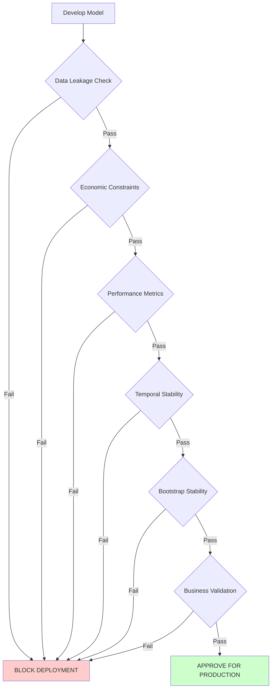

# Model Validation Guidelines

**Repository:** annuity-price-elasticity-v3
**Last Updated:** 2026-01-28

---

## Overview

Complete validation procedures for RILA price elasticity models, from pre-deployment checks to ongoing monitoring. This framework ensures models meet statistical, economic, and business requirements before production deployment.

**Validation Philosophy:** Multiple layers of validation provide defense-in-depth against model risk.

---

## Validation Framework

### 1. Pre-Deployment Validation (MANDATORY)

All models MUST pass these validations before production deployment:

#### 1.1 Data Leakage Check

**Reference:** [../practices/LEAKAGE_CHECKLIST.md](../practices/LEAKAGE_CHECKLIST.md) (MANDATORY)

**Critical Checks:**
- [ ] No lag-0 competitor features (minimum 2-week lag required)
- [ ] Sales lags are backward only (no future sales predict past)
- [ ] application_signed_date used (not contract_issue_date)
- [ ] 50-day mature data cutoff applied (incomplete recent data excluded)
- [ ] No forward-looking temporal features

**Why This Matters:**
Data leakage causes artificially inflated performance metrics that fail catastrophically in production. A model with 95% R² in validation but data leakage will have 0% predictive value for new data.

**Enforcement:**
- **Automated:** Feature naming conventions enforced (`_lag_0` only for own rate)
- **Manual:** Code review of feature engineering pipeline
- **Validation:** Economic constraints catch some leakage (e.g., competitor β>0 suggests leakage)

---

#### 1.2 Economic Constraint Validation

**Microeconomic Theory Requirements:**

**Quality Signaling (Own Rate):**
- **Constraint:** β > 0 for Prudential rate features
- **Theory:** Higher cap rates signal superior product value and financial strength
- **6Y20B Context:** Enhanced signaling effect due to 6-year commitment + 20% buffer
- **Validation:** All bootstrap samples (10,000 for inference) must show β > 0

**Competitive Pressure (Competitor Rates):**
- **Constraint:** β < 0 for competitor rate features
- **Theory:** Higher competitor rates reduce our relative competitive advantage
- **Cross-Elasticity:** Multi-firm modeling captures market dynamics
- **Validation:** All bootstrap samples must show β < 0

**Contract Processing Persistence (Sales Lags):**
- **Constraint:** β > 0 for lagged sales features
- **Theory:** Recent sales momentum continues due to processing and distribution lags
- **6Y20B Enhancement:** Longer commitment amplifies persistence effects
- **Validation:** All bootstrap samples must show β > 0

**Statistical Significance:**
- **Requirement:** All coefficients significant at α = 0.05 level
- **Validation:** T-statistics and p-values checked for each feature

**Pass Criteria:**
- 100% coefficient sign consistency across all bootstrap samples
- All coefficients statistically significant (p < 0.05)
- No theoretically implausible relationships

**Failure Action:**
If constraints violated:
1. **STOP** - Do NOT deploy model
2. Investigate feature engineering for leakage
3. Review AIC selection for spurious correlations
4. Consider alternative lag structures
5. Re-run validation after fixes

**Reference:** `src/features/selection/constraints_engine.py`

---

#### 1.3 Temporal Stability Check

**Expanding Window Cross-Validation:**

**Methodology:**
- Initial training: First ~50 weeks
- Validation: 1-week ahead forecasts
- Expansion: Training set grows with each validation period
- Current: 130+ out-of-sample forecasts (as of November 2025, expanding weekly)

**Performance Requirements:**
| Metric | Target | Warning | Critical |
|--------|--------|---------|----------|
| R² | > 50% | < 55% | < 50% |
| MAPE | < 20% | > 15% | > 20% |
| Coverage | 90-97% | 88-90% or 97-99% | < 88% or > 99% |

**Temporal Analysis:**
- **Early Period MAPE:** Should be strong (historical: 8.1%)
- **Late Period MAPE:** Monitor for drift (historical: 20.1%)
- **13-Week Rolling MAPE:** Track trends, alert if > 15%

**Drift Detection:**
```
If MAPE_rolling_13w > 15%: WARNING
If MAPE_rolling_13w > 20%: CRITICAL (trigger model refresh)
If MAPE_late_period - MAPE_early_period > 10%: Investigate structural change
```

**Pass Criteria:**
- Overall MAPE < 20%
- No catastrophic drift in late periods
- Performance stable across market volatility regimes

**Reference:** `src/models/cross_validation.py`

---

#### 1.4 Baseline Comparison

**Benchmark Model:** Rolling Average

**Current Benchmark Performance:**
- R²: 57.54%
- MAPE: 16.40%

**Requirements:**
- Model R² must exceed benchmark by realistic margin
- **Realistic:** 10-30% improvement (achieved: +36.2%)
- **Suspicious:** > 50% improvement (investigate for leakage)
- **Insufficient:** < 10% improvement (model may not add value)

**Why Baseline Matters:**
Ensures model provides meaningful improvement over simple heuristics. A model barely beating baseline may not justify complexity and maintenance costs.

**Pass Criteria:**
- R² improvement: 10-30% range (moderate, realistic)
- MAPE improvement: 10-25% range (moderate, realistic)
- Improvements consistent across validation periods

**Reference:** [../analysis/BASELINE_COMPARISON.md](../analysis/BASELINE_COMPARISON.md)

---

### 2. Model Performance Validation

#### 2.1 Metrics Requirements

**Explanatory Power:**
- **R² (Coefficient of Determination):** > 50% required, > 70% excellent
- **Current:** 78.37% (exceeds excellent threshold)
- **Interpretation:** Model explains 78.37% of sales volume variance

**Forecast Accuracy:**
- **MAPE (Mean Absolute Percentage Error):** < 20% required, < 15% excellent
- **Current:** 12.74% (exceeds excellent threshold)
- **Interpretation:** Average forecast error 12.74% for strategic planning

**Volatility-Weighted Performance:**
- **Vol-Weighted R²:** Should degrade < 2% from standard R²
- **Current:** 77.60% (0.77% degradation, excellent stability)
- **Interpretation:** Model stable across market volatility regimes

**Uncertainty Calibration:**
- **95% CI Coverage:** 90-97% target range (well-calibrated)
- **Current:** 94.4% (well-calibrated)
- **Interpretation:** 95% prediction intervals contain ~95% of actuals

**Performance Thresholds:**
| Metric | Production | Warning | Critical |
|--------|-----------|---------|----------|
| R² | > 50% | 50-55% | < 50% |
| MAPE | < 20% | 15-20% | > 20% |
| Coverage | 90-97% | 88-90% or 97-99% | < 88% or > 99% |
| Vol-Weighted R² Degradation | < 2% | 2-5% | > 5% |

---

#### 2.2 Cross-Validation

**Expanding Window Methodology:**

```
Week 1-50:    [Training] → Week 51 forecast
Week 1-51:    [Training] → Week 52 forecast
Week 1-52:    [Training] → Week 53 forecast
...
Week 1-N:     [Training] → Week N+1 forecast
```

**Why Expanding (Not K-Fold):**
- Preserves temporal ordering (no future data in training)
- Simulates production deployment (growing history)
- Prevents time-series-specific leakage

**Validation Requirements:**
- Minimum 100 out-of-sample forecasts for robust assessment
- Current: 130+ forecasts (growing weekly)
- Forecast horizon: 1-week ahead (aligned with business cycle)

**Pass Criteria:**
- Consistent performance across all validation periods
- No catastrophic failures in any single period
- Late-period performance within acceptable range of early-period

---

#### 2.3 Out-of-Sample Testing

**Holdout Period Requirements:**

**Minimum Holdout:** 20% of total observations
- Current: 130+ weeks out of 160 total = 81% validated out-of-sample

**Temporal Coverage:**
- Must span multiple years (seasonal effects)
- Must include high and low volatility periods
- Current: 2023-04-02 onwards (2+ years as of Nov 2025)

**No Peeking:**
- Holdout data NEVER used for:
  - Feature selection
  - Hyperparameter tuning
  - Model architecture decisions
- Only used for final performance assessment

**Pass Criteria:**
- Holdout performance within 5% of training performance
- No systematic bias in holdout predictions

---

### 3. Sensitivity Analysis

#### 3.1 Bootstrap Stability

**Coefficient Sign Consistency:**
- **Requirement:** 100% of bootstrap samples show correct signs
- **Current:** 10,000 bootstrap samples, 100% consistency achieved
- **Interpretation:** Coefficient estimates are robust, not sample-dependent

**Confidence Interval Width:**
- **Requirement:** CI width should be reasonable for business decisions
- **Current:** $16.8M weekly uncertainty (reasonable for strategic planning)
- **Too Wide:** > $30M suggests high model uncertainty
- **Too Narrow:** < $5M may indicate underestimation of uncertainty

**Bootstrap Sample Size:**
- **Inference:** 10,000 samples for detailed uncertainty quantification
- **Forecasting:** 1,000 samples balances accuracy and computational efficiency
- **Minimum:** 100 samples (insufficient for production)

**Pass Criteria:**
- 100% coefficient sign consistency
- CI width reasonable for business application
- Coverage within 90-97% target range

---

#### 3.2 Feature Selection Stability

**AIC Consistency:**

**Evaluation:**
- Top 5 lowest AIC scores should select similar features
- Current: Top 5 models all include sales_lag, competitor_rate, own_rate
- Instability: Top 5 models select completely different features

**Lag Structure Consistency:**
- Optimal lags should be consistent across model variants
- Current: Lag-5 sales, Lag-2 competitor consistently selected
- Instability: Optimal lag varies wildly (lag-1 vs lag-10)

**Economic Constraint Pass Rate:**
- **Current:** 193/793 combinations pass (24.3%)
- **Expected:** 15-35% pass rate (not too strict, not too lenient)
- **Too High (>50%):** Constraints may be too weak
- **Too Low (<10%):** Constraints may be too strict or data quality issues

**Pass Criteria:**
- Top 5 AIC models select similar core features
- Lag structures consistent across model variants
- Economic constraint pass rate 15-35%

---

#### 3.3 Coefficient Stability

**Magnitude Consistency:**

**Across Bootstrap Samples:**
- Standard deviation of coefficients should be reasonable
- Large std dev suggests unstable estimates

**Across Validation Periods:**
- Coefficients should not change dramatically over time
- Slow drift acceptable (market evolution)
- Sudden jumps suggest structural break or data issue

**Warning Signs:**
- Coefficient sign flips between validation periods
- Coefficient magnitude changes > 2x
- Coefficients become non-significant over time

**Pass Criteria:**
- Coefficient std dev < 50% of mean
- No sign flips across validation periods
- Magnitudes stable within 2x range

---

### 4. Business Logic Validation

#### 4.1 Elasticity Reasonableness

**Expected Ranges by Product:**

**RILA 6Y20B:**
- Own rate elasticity: β ∈ [0.001, 0.100] (positive quality signaling)
- Competitor elasticity: β ∈ [-0.100, -0.001] (negative competitive pressure)
- Sales persistence: β ∈ [0.300, 0.900] (high persistence for 6-year product)

**Interpretation:**
- **Too Strong (β > 0.100):** Unrealistic sensitivity, check for leakage
- **Too Weak (β < 0.001):** Feature may not be informative
- **Wrong Sign:** Economic constraint violation

**Scenario Testing:**
- 100bp rate increase should produce 5-20% sales impact
- 450bp rate increase ("uncapped") should produce 20-100% sales impact
- Results outside these ranges warrant investigation

**Pass Criteria:**
- Elasticities within expected ranges
- Scenario impacts align with business intuition
- Stakeholder review confirms plausibility

---

#### 4.2 Competitive Response

**Market Alignment:**

**Competitive Dynamics:**
- When all carriers raise rates together: Sales should remain stable
- When only Prudential raises rates: Sales may increase (quality signal)
- When only competitors raise rates: Sales should increase (competitive advantage)

**Top-N Competitor Analysis:**
- Top 5 competitors should have meaningful impact (β ≠ 0)
- Individual small competitors may have negligible impact

**Market Share Weighting:**
- High-share competitors should dominate competitive metric
- Weights should sum to 1.0 (normalization check)

**Pass Criteria:**
- Model captures multi-firm competitive dynamics
- Predictions align with observed market behavior
- Competitive response timing (2-week lag) matches business reality

---

#### 4.3 Stakeholder Review

**Business Validation:**

**Review with Annuity Rate Setting Team:**
- Present model predictions for recent historical periods
- Compare to actual outcomes
- Discuss any discrepancies

**Key Questions:**
- Do predictions align with team's market experience?
- Are confidence intervals useful for decision-making?
- Do competitive insights match observed market dynamics?
- Are there any periods where model failed badly?

**Documentation:**
- Record stakeholder feedback
- Document any concerns or limitations identified
- Update model documentation with business context

**Pass Criteria:**
- Stakeholders confirm model outputs are reasonable
- No fundamental disagreements with model logic
- Business team willing to use model for rate decisions

---

### 5. Production Readiness Checklist

**Pre-Deployment Sign-Off:**

- [ ] **Data Leakage:** All checks passed ([LEAKAGE_CHECKLIST.md](../practices/LEAKAGE_CHECKLIST.md))
- [ ] **Economic Constraints:** 100% coefficient sign consistency
- [ ] **Performance Metrics:** R² > 50%, MAPE < 20%, Coverage 90-97%
- [ ] **Baseline Comparison:** 10-30% realistic improvement over benchmark
- [ ] **Temporal Stability:** No catastrophic drift in late periods
- [ ] **Bootstrap Stability:** CI widths reasonable, 100% sign consistency
- [ ] **Feature Selection:** Top 5 AIC models consistent
- [ ] **Coefficient Stability:** No sign flips, magnitudes stable
- [ ] **Elasticity Reasonableness:** Within expected ranges for product type
- [ ] **Competitive Response:** Multi-firm dynamics captured correctly
- [ ] **Stakeholder Review:** Business team approval obtained
- [ ] **Documentation:** Complete technical and business documentation
- [ ] **RAI Governance:** RAI registration updated (RAI000038)
- [ ] **Emergency Procedures:** Runbook tested and validated

**Final Approval:**
- **Model Risk:** Quarterly review approved
- **Technical Owner:** Sign-off on performance
- **Business Owner:** Sign-off on reasonableness
- **Date:** _____________

---

## Validation Workflow

### Visual Validation Process



### Sequential Validation Steps

1. **Data Leakage Check** (MANDATORY first step)
   - Cheapest validation, catches fatal flaws immediately
   - Reference: [LEAKAGE_CHECKLIST.md](../practices/LEAKAGE_CHECKLIST.md)

2. **Economic Constraints** (Second validation layer)
   - Validates theoretical soundness
   - Prevents spurious correlations

3. **Performance Metrics** (Third validation layer)
   - Confirms statistical adequacy
   - Compares to benchmark and thresholds

4. **Temporal Stability** (Fourth validation layer)
   - Ensures robustness over time
   - Detects model drift

5. **Bootstrap Stability** (Fifth validation layer)
   - Quantifies uncertainty
   - Validates coefficient robustness

6. **Business Validation** (Final validation layer)
   - Stakeholder review and approval
   - Real-world reasonableness check

**Why Sequential:**
- Early validations are cheap and catch fatal flaws fast
- Later validations are expensive and nuanced
- No point doing expensive validation if cheap checks fail

---

## Failure Investigation

**When Validation Fails:**

### Step 1: Identify Failure Mode

**Data Leakage Failure:**
- Symptom: Unrealistic R² (> 95%), wrong coefficient signs
- Investigation: Review feature engineering for future information
- Resolution: Fix lag structures, re-validate

**Economic Constraint Failure:**
- Symptom: Coefficient signs violate theory
- Investigation: Review feature selection, check for confounders
- Resolution: Filter invalid features, consider alternative specifications

**Performance Failure:**
- Symptom: MAPE > 20%, R² < 50%
- Investigation: Review data quality, feature engineering, model specification
- Resolution: Enhance features, consider alternative models, validate data

**Temporal Instability Failure:**
- Symptom: MAPE_late >> MAPE_early
- Investigation: Structural market changes, data quality issues
- Resolution: Model refresh, sliding window approach, feature updates

**Bootstrap Instability Failure:**
- Symptom: Wide confidence intervals, inconsistent signs
- Investigation: Small sample size, multicollinearity, outliers
- Resolution: Increase data, add regularization, remove outliers

**Business Logic Failure:**
- Symptom: Stakeholders reject predictions as unrealistic
- Investigation: Review with business team, identify discrepancies
- Resolution: Feature engineering updates, model specification changes

### Step 2: Document Finding

- Record failure mode in validation log
- Document investigation steps
- Capture resolution approach

### Step 3: Fix and Re-Validate

- Implement fix
- Re-run ENTIRE validation sequence (not just failed step)
- Document new validation results

### Step 4: Update Documentation

- Update technical documentation with lessons learned
- Update validation guidelines if new failure mode discovered
- Share with team to prevent recurrence

**Reference:** [FAILURE_INVESTIGATION.md](FAILURE_INVESTIGATION.md)

---

## Ongoing Production Monitoring

**Post-Deployment Validation:**

### Weekly Monitoring

- **Data Quality:** TDE completeness, WINK rate availability
- **Prediction Errors:** MAPE for latest week
- **Coefficient Signs:** Economic constraints still satisfied

### Biweekly Monitoring (Model Refresh)

- **Performance Metrics:** R², MAPE, Coverage for latest validation period
- **13-Week Rolling MAPE:** Trend analysis for drift detection
- **Feature Selection:** AIC optimal model consistency
- **Bootstrap Stability:** Confidence interval calibration

### Quarterly Monitoring (Model Risk Review)

- **Comprehensive Performance Review:** All metrics vs thresholds
- **Temporal Stability Analysis:** Early vs late period comparison
- **Stakeholder Feedback:** Business team satisfaction survey
- **Documentation Currency:** Ensure docs match production system

### Annual Monitoring (Independent Validation)

- **Full Validation Sequence:** Independent team re-runs all checks
- **Benchmark Comparison Update:** Refresh benchmark performance
- **Methodology Review:** Consider methodological improvements
- **Regulatory Compliance:** Ensure RAI governance current

**Alert Thresholds:**
| Alert Level | Condition | Action |
|-------------|-----------|--------|
| **INFO** | MAPE 12-15% | Log for tracking, no action |
| **WARNING** | MAPE 15-20% | Review within 1 week, consider refresh |
| **CRITICAL** | MAPE > 20% | Immediate model refresh required |
| **FATAL** | Economic constraint violation | STOP using model, investigate immediately |

---

## References

### Validation Documentation
- **Leakage prevention:** [../practices/LEAKAGE_CHECKLIST.md](../practices/LEAKAGE_CHECKLIST.md) (MANDATORY)
- **Failure investigation:** [FAILURE_INVESTIGATION.md](FAILURE_INVESTIGATION.md)
- **Emergency procedures:** [../operations/EMERGENCY_PROCEDURES.md](../operations/EMERGENCY_PROCEDURES.md)

### Methodology Documentation
- **Feature engineering:** [feature_engineering_guide.md](feature_engineering_guide.md)
- **Complete methodology:** [../business/methodology_report.md](../business/methodology_report.md)
- **RAI governance:** [../business/rai_governance.md](../business/rai_governance.md)

### Implementation References
- **Cross-validation:** `src/models/cross_validation.py`
- **Economic constraints:** `src/features/selection/constraints_engine.py`
- **AIC selection:** `src/features/selection/aic_engine.py`
- **Bootstrap ensemble:** `src/models/inference_models.py`

---

**Last Updated:** 2026-01-28
**Version:** 2.0 (v2 refactored architecture)
**Owner:** Brandon Behring
**Review Cycle:** Annual
