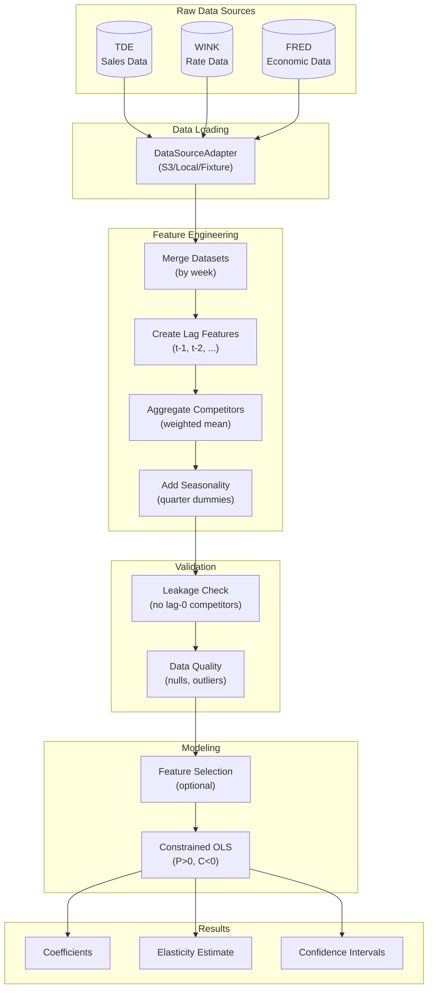
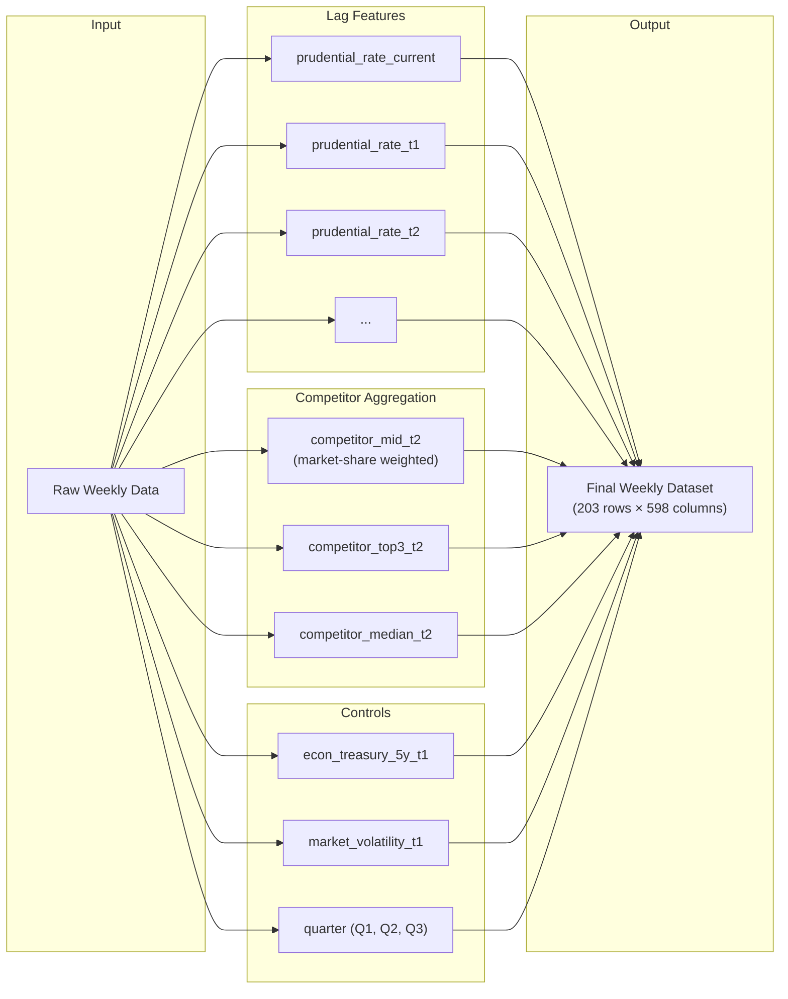
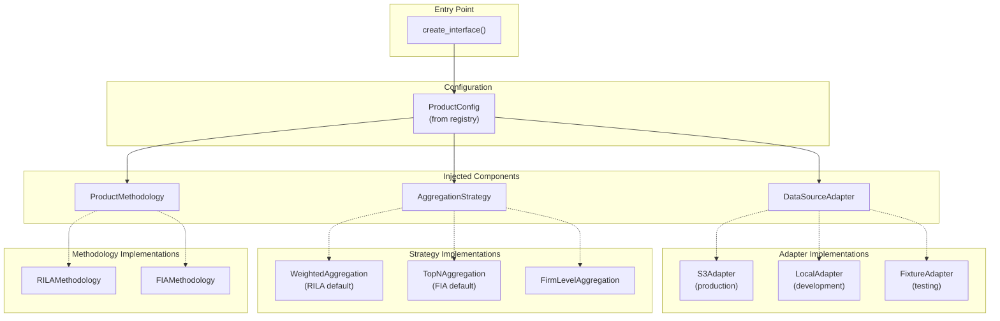
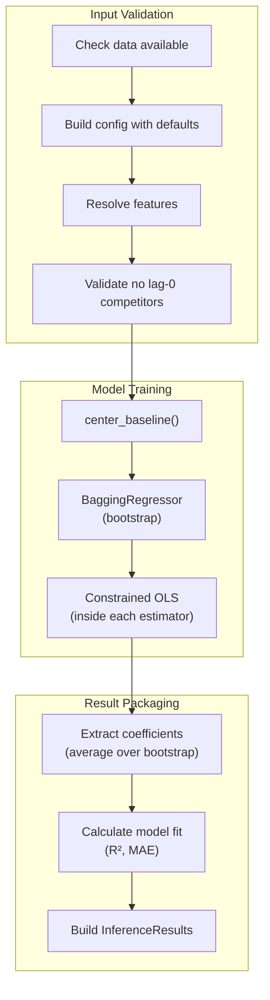

# Data Pipeline Architecture

**Visual guide to data flow in the RILA price elasticity system.**

---

## High-Level Data Flow



---

## Data Sources

### TDE (Sales Data)

```
Source: Internal transaction system
Update: Daily
Content: Weekly premium by product

Key Fields:
├── week_start_date     (date of week start)
├── product_name        (e.g., "FlexGuard 6Y 20%")
├── total_premium       (dollar amount)
└── application_count   (number of applications)
```

### WINK (Rate Data)

```
Source: WINK database
Update: Daily
Content: Competitor cap rates

Key Fields:
├── effective_date      (rate effective date)
├── company             (issuer name)
├── product_code        (product identifier)
├── ratePct             (cap rate as decimal)
└── bufferModifier      (buffer type indicator)
```

### FRED (Economic Data)

```
Source: Federal Reserve Economic Data
Update: Daily (DGS5), Daily (VIX)
Content: Economic indicators

Key Series:
├── DGS5    (5-Year Treasury Constant Maturity)
└── VIXCLS  (CBOE Volatility Index)
```

---

## Feature Engineering Pipeline



---

## Feature Naming Convention

```
{entity}_{metric}_{lag}

Examples:
┌─────────────────────────────────┬──────────────────────────────────┐
│ Feature Name                    │ Meaning                          │
├─────────────────────────────────┼──────────────────────────────────┤
│ prudential_rate_current         │ Prudential's rate at time t      │
│ prudential_rate_t1              │ Prudential's rate at t-1         │
│ competitor_mid_t2               │ Weighted competitor mean at t-2  │
│ econ_treasury_5y_t1             │ Treasury rate at t-1             │
│ sales_target_current            │ Sales at time t (target)         │
└─────────────────────────────────┴──────────────────────────────────┘
```

---

## Lag Structure Visualization

```
Time
│
│  t-3    t-2    t-1    t=0
│   │      │      │      │
│   ▼      ▼      ▼      ▼
│
│  ┌───┐  ┌───┐  ┌───┐  ┌───┐
│  │C_3│  │C_2│  │C_1│  │C_0│  ← Competitor Rates
│  └───┘  └───┘  └───┘  └─X─┘    (C_0 FORBIDDEN!)
│    ↓      ↓      ↓
│    └──────┴──────┴───────────→ Used in Model
│
│                        ┌───┐
│                        │P_0│  ← Own Rate (OK at t=0)
│                        └───┘
│                          ↓
│                          └───→ Treatment Variable
│
│                        ┌───┐
│                        │Y_t│  ← Sales (Outcome)
│                        └───┘
│
▼
```

**Why lag-0 competitors are forbidden**: They're simultaneously determined with sales by market conditions (simultaneity bias).

---

## Dependency Injection Architecture



---

## Inference Pipeline



---

## File Locations

```
Data Flow Through Repository:

tests/fixtures/rila/
├── raw_sales_data.parquet          ← TDE equivalent
├── wink_competitive_rates_pivoted.parquet  ← WINK rates
├── economic_indicators/
│   ├── dgs5.parquet                ← Treasury rates
│   └── vixcls.parquet              ← Volatility
├── market_share_weights.parquet    ← For weighted aggregation
└── final_weekly_dataset.parquet    ← Merged + engineered

src/
├── data/adapters/
│   ├── fixture_adapter.py          ← Loads fixtures
│   └── s3_adapter.py               ← Loads from AWS
├── features/
│   ├── aggregation/                ← Competitor aggregation
│   └── selection/                  ← Feature selection
└── notebooks/
    └── interface.py                ← UnifiedNotebookInterface
```

---

## Validation Gates

```
Pipeline Validation Points:

1. Data Loading
   └── Check: Files exist, not empty

2. Feature Engineering
   └── Check: No future data used, lags computed correctly

3. Pre-Inference Validation
   └── Check: No lag-0 competitors in feature list
   └── Check: Required columns exist

4. Post-Inference Validation
   └── Check: Coefficient signs match expectations
   └── Check: R² is reasonable (not suspiciously high)

5. Pre-Deployment Gate
   └── Check: Full LEAKAGE_CHECKLIST.md review
```

---

## Quick Reference: Column Categories

| Category | Pattern | Example | Count |
|----------|---------|---------|-------|
| Target | `sales_target_*` | `sales_target_current` | ~40 |
| Own Rate | `prudential_rate_*` | `prudential_rate_t2` | ~20 |
| Competitor | `competitor_*` | `competitor_mid_t2` | ~150 |
| Economic | `econ_*`, `market_*` | `econ_treasury_5y_t1` | ~40 |
| Derived | `derived_*` | `derived_prudential_rate_squared_t1` | ~200 |
| Temporal | `date`, `quarter`, etc. | `quarter` | ~10 |

---

## See Also

- `knowledge/domain/WINK_SCHEMA.md` - WINK data structure
- `knowledge/domain/TDE_SCHEMA.md` - TDE data structure
- `docs/architecture/MULTI_PRODUCT_DESIGN.md` - Architecture decisions
- `knowledge/analysis/CAUSAL_FRAMEWORK.md` - Why this structure
